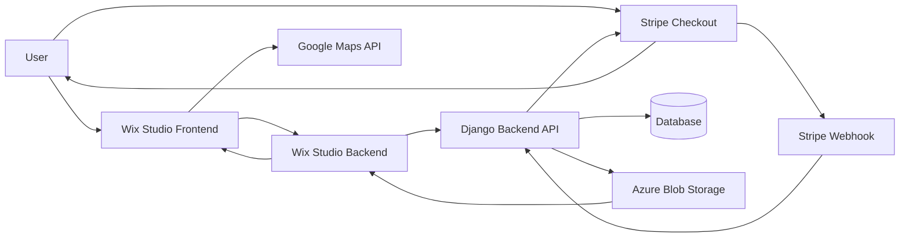

# ASA Adopt-a-Tree

## Table of Contents
1. [Project Overview](#project-overview)
2. [Features](#features)
3. [System Architecture](#system-architecture)
4. [Setup Instructions](#setup-instructions)
5. [Database Structure](#database-structure)
6. [Authentication](#authentication)
7. [Core Functionality](#core-functionality)
8. [User Interfact](#user-interface)
9. [Deployment](#depolyment)
10. [Code Structure](#code-structure)
11. [References](#references)

## Project Overview 
Django web application for managing tree adoptions and donor contributions on an interactive map hosted through Wix Studio. The frontend allows donors to view a variety of trees within the Alliance for a Sustainable Amazon's property as well as adopt them for one year. The backend allows administrators to view, add, edit, and remove trees and donations from the database. 

**Important:** Although this repository only contains the Django app service, the following README file documents the entire project. The final product can be found on the [official Alliance for a Sustainable Amazon website](https://www.sustainableamazon.org/reforestation). (This map is not yet publicly accessible and will become available on launch day.)

---

## Features
### Backend
- Django:
    - Track donors, donations, and trees
    - Manage tree adoption status
    - Admin dashboard for data management
    - Create Stripe checkout sessions
- Wix Studio:
    - Obtain basic information about all trees or detailed information about individual trees
    - Fetch Stripe checkout sessions

### Frontend
- View tree locations on interactive map
- Access specific tree data (name, diameter at breast height, height, tag number, image)
- Adopt trees and view already adopted trees

---

## System Architecture
### Technology Stack
- **Frontend:** HTML, CSS, JavaScript, Django templates, Google Maps API, Stripe checkout sessions
- **Backend:** Django 6.0.4, Python 3.14.4, Wix Studio backend (`.jsw`)
- **Database:** PostgreSQL 
- **Deployment:** Azure App Service, Azure Flexible Server (database), Azure Blob Storage, Wix Studio, Stripe

### Architecture Visualization


---

## Setup Instructions
**Important:** These setup instructions pertain to local development and testing. All secret key variables and links mentioned in this section should be swapped out for production variables upon launch and production testing. For information on how to configure each part for deployment, see [Deployment](#deployment).

### Setup Prerequisites
- Python 3.14+
- Stripe CLI 1.41+ 
- Access to the Wix Studio website
- ngrok 3.39+ (optional)

### Backend Django Setup:
#### 1. Clone the repository:
```bash
git clone https://github.com/Alliance-for-a-Sustainable-Amazon/ASA-Adopt-A-Tree.git
cd adopt-a-tree
```
#### 2. Create virtual environment:
```bash
python -m venv venv
source venv/bin/activate # Windows: venv/Scripts/activate
```
#### 3. Install backend dependencies:
```bash
pip install -r requirements.txt
```
#### 4. Set up environment variables:
```bash
cp .env.example .env
```
#### 5. Run migrations:
```bash
python manage.py migrate
```
#### 6. Create superuser:
```bash
python manage.py createsuperuser
```
#### 7. Run server:
```bash
python manage.py runserver
```

### Stripe Setup:
1. Create or log into your Stripe account through the Stripe dashboard
    - Make sure you enter the Testing Suite for development
2. Obtain Stripe secret key on the dashboard
3. Add the secret key to the `.env` file under `STRIPE_SECRET_KEY`
4. Open the Developer tab
5. Create a new webhook:
    - Set the URL: `your-local-link/api/stripe-webhook/`
    - Copy the webhook signing secret
6. Add the webhook signing secret to the `.env` file under `STRIPE_WEBHOOK_SECRET`

### Wix Studio Setup:
1. Open Wix Studio site
2. Enable Velo Dev mode
3. Duplicate the current page containing the map
4. Make the duplicated page unindexable and set the URL to some random string
3. Configure the Backend API URL:
    - Update `BASE_URL` in `treeApis.jsw` to point toward hosting service URL (ngrok, etc)
4. Publish site

### ngrok Setup (optional):
**Important:** Although ngrok is marked as optional, some form of hosting is necessary to allow Wix Studio and Stripe to access the localhost.

1. In a new terminal, start ngrok:
```bash
ngrok 8000
```
2. Copy the URL that appears in the terminal and update `BASE_URL` in `treeApis.jsw` on Wix Studio
3. Add the URL to `ALLOWED_HOSTS` in the `.env` file
---

## Database Structure
### Database Models
- **Tree:** The core model that contains information regarding each adoptable / adopted tree
- **Donor:** Keeps each user who has donated along with their total donation amount. Each user is tied to a unique email
- **Donation:** Represents tree adoptions containing information about the donation, the donor, and which tree was adopted

### Model Relationships
- **Tree &rarr; Donation:** One to one relationship (one tree can be related to one donation)
- **Donor &rarr; Donation:** One to many relationship (one donor can be related many donations)

### Key Implementation
- **UUID:** All models contain a UUID primary key for safety due to sensitive donor information

---

## Authentication
### Django Authentications
#### User Roles
- **Admin:** Full access to user management, database management, and Django admin panel

#### API Access and Permissions
- Enforced with:
    - **Function decorators (**`@api_view(['GET'])`**,** `@api_view(['POST'])`**):** Specifies which actions are allowed for each API view
    - `CORS_ALLOWED_ORIGINS`**:** States what websites are able to access the API views
    - `DJANGO_API_KEY`**:** Prevents API views from being accessable without providing a secret key

#### Creating Admin User via Environment Variables
- Automated admin creation available:
    - `DJANGO_ADMIN_EMAIL` (defaults to 'admin@example.com')
    - `DJANGO_ADMIN_USER` (defaults to 'admin')
    - `DJANGO_ADMIN_PASSWORD` (required)
    - **Management Command:** `python manage.py create_admin`

### Google Cloud Authentication
- Enforced with:
    - **API restrictions:** Maps Javascript API, Maps Static API
    - **Website restrictions:** Google Map API can only be called by the provided website urls
    - **Quotas:** Setting up 'per day' and 'per minute' quotas prevents constant API calls and going over the free limit

### Stripe Authentication
- Enforced with:
    - **Secret Keys:** `STRIPE_WEBHOOK_SECRET`, `STRIPE_SECRET_KEY`
    - **Stripe Header:** Stripe webhooks provide a secret header to prevent data from being edited or accessed by outside sources
    - **Expiration Timer:** 30 minute timeout on Stripe checkouts helps to prevent two people attempting to adopt the same tree
---

## Core Functionality
### Backend Functionality
#### Tree Management
- Add, edit, and remove trees in the admin portal
    - Adoption status automatically managed by Stripe webhook
- Organized into sections:
    - Identifiers
    - Date Information
    - Adoption Status
    - Tree Information
    - Location Information
    - Study Information
    - Notes

#### Donor Management
- Add, edit, and remove donors in the admin portal
    - Automatically created and managed through Stripe webhook
- Organized into sections:
    - Identifiers
    - Donor Information

#### Donation Management
- Add, edit, and remove donations in the admin portal
    - Automatically created through Stripe webhook
- Organized into sections:
    - Identifiers
    - Donation Date and Expiration
    - Donation Information
    - Donor Information
    - Tree Adopted
    - Notes

#### API endpoints
- Variety of endpoints that return necessary information
- All APIs require an API key
- `tree_updates`**:**
    - `last_updated`: Timestamp of latest tree update
    - `tree_count`: Number of tree records
- `tree_map_data`**:**
    - `id`: Tree's ID
    - `tag_id`: Tree's tag ID
    - `local_name`: Tree's local name (Spanish name)
    - `lat`: Tree's latitude
    - `lng`: Tree's longitude
    - `adoption_status`: Tree's adoption status
- `tree_detail_data`**:**
    - `id`: Tree's ID
    - `permanent_tag`: Tree's unique tag
    - `local_name`: Tree's local name (Spanish name)
    - `english_name`: Tree's name in English (if it exists)
    - `genus`: Tree's genus
    - `species`: Tree's species (if known)
    - `lat`: Tree's latitude
    - `lng`: Tree's longitude
    - `dbh`: Tree's diameter at breast height
    - `height`: Tree's height
    - `adoption_status`: Tree's adoption status
    - `donor_name`: Name of the donor who adopted the tree
    - `species_description`: List of species facts 
- `create_checkout_session`**:**
    - `url`: Stripe checkout session URL

#### Stripe webhook
- Automatically adds donation and donor (if applicable) records to database

#### Certificate Generation
- Automatically generated certificate containing:
    - Tree Information
    - Tree Image
    - Adoption Period
    - Donor Name
    - Website URL
- Email containing certificate sent to donor

### Frontend Functionality
#### Map
- Move the map around and see the surrounding area in satellite view
- See exact locations of pins on the map

#### Popup
- View detailed tree data as well as an image of the tree
- Button to open the adoption checkout session if adoptable, donor name if not

#### Stripe Checkout
- Pricing information
- Terms and Conditions
- Boxes to fill out payment information

---

## User Interface
### Backend Interface
- **Admin Panel:**
    - Tables for:
        - Trees
        - Donors
        - Donations
    - Search and filter functionality for each table
    - Ability to add new admin user accounts

### Frontend Interface
- **Wix Studio:**
    - Interactive Google Map
    - Tree popups
    - Adoption reserved popup
- **Stripe Checkout:**
    - Checkout session with payment information
    - Payment result page (redirected to Wix Studio)

---

## Deployment
### Azure
- **Prerequisites:** Azure account, Azure CLI, Git, Python 3.14+
- **Environment Variables:** `DJANGO_SECRET_KEY`, `DJANGO_API_KEY`, `DJANGO_SETTINGS_MODULE`, `DJANGO_DEBUG`, `DJANGO_ADMIN_EMAIL`, `DJANGO_ADMIN_USER`, `DJANGO_ADMIN_PASSWORD`, `POSTGRES_DATABASE`, `POSTGRES_USER`, `POSTGRES_PASSWORD`, `POSTGRES_HOST`, `POSTGRES_PORT`, `STRIPE_SECRET_KEY`, `STRIPE_WEBHOOK_KEY`, `ALLOWED_HOSTS`, `CSRF_TRUSTED_ORIGINS`, `CORS_ALLOWED_ORIGINS`, `AZURE_BLOB_STORAGE`, `AZURE_BLOB_CONTAINER`, `AZURE_CONNECTION_STRING`
- **Steps:**
    - Create resources (resource group, app service plan, PostgreSQL server, database, web app)
    - Configure environment variables
    - Deploy code via Git
    - Authentication setup: migration, admin creation, permission setup
- **Database:** Azure PostgreSQL Flexible Server (connection pooling, SSL, env-based config)

### Google Cloud
- **Prerequisites:** Google Cloud account
- **Steps:**
    - Configure restrictions:
        - API restrictions: Maps JavaScript API, Maps Static API
        - Application restrictions (Websites): Add the necessary websites to this section
            - **Important:** Wix Studio requires a **fileusr** link, not just the website domain. This can be found using Inspect Element and copying the link provided by the Google Maps error message when the map is not loading.
    - Copy API key
    - Add key into the map iframe on Wix Studio

### Wix Studio
- **Prerequisites:** Wix Studio account
- **Wix Studio Secret Manager:** `DJANGO_API_KEY`
- **Steps:**
    - Create frontend elements (iframe for map, popup, Velo page code, Wix Studio backend JSW file)
    - Configure Wix Studio secrets
    - Publish site

### Stripe
- **Prerequisites:** Stripe account
- **Environment Variables:** `STRIPE_SECRET_KEY`, `STRIPE_WEBHOOK_SECRET`
- **Steps:** 
    - Create a webhook pointed to backend
    - Obtain environment variables and add them to Azure

---

## Code Structure
### Backend
- Django:
    - `trees/`**:** Main app (models, views, admin, templates, static, management commands)
    - `adopt_a_tree/`**:** Project settings
    - `staticfiles/`**:** Collection of files from `trees/static/` for production use
- Wix Studio:
    - `treeApis.jsw`**:** API calls to Django backend


### Frontend
- **Home page code:** Contains all button functionality and Wix Studio backend calls 
- `html1` **iframe:** Map settings (Google Maps loading, pin loading)
- `adoptionButton` **iframe:** Holds payment link functionality
- `treeImage` **iframe:** Image monitoring and deployment
--- 

## Coding Standards
### General
- Code prioritizes readability and organization over being overly concise
- Descriptive variable, function, class names, and UI used
- Complex logic documented with comments
- Sensitive information such as API keys, connection strings, and secret keys stored in environment variables and secret managers

### Python / Django
- Code generally follows PEP 8 conventions
- Business logic resides inside Django backend, not Wix Studio frontend
- API validation required for all data requests from the database
- Stripe webhook signatures must be verified before processing information into the database

### JavaScript / Wix Studio
- Asynchronous operations use `async` / `await` when necessary
- Frontend code focuses on user interaction, while backend code focuses on API requests
- Error handling implemented into API requests and user interface to prevent user from being in the dark

### HTML / CSS
- HTML uses meaningful identifiers
- CSS generally organized by component / feature when possible
- Reusable styles used when possible

### Version Control
- Commit messages and descriptions generally provide a clear understanding of what has changed
- Debug and testing code removed before deployment, unless there are plans to use it in the future
- All changes tested before being merged
- Branches used to seperate changes and logic
    - Branches thoroughly tested before merging into main to prevent as many bugs as possible

---

## References
- [Official Django documentation](https://docs.djangoproject.com/en/6.0/)

- [Official Django tutorial](https://docs.djangoproject.com/en/6.0/intro/tutorial01/)

- [Official Wix Studio documentation](https://support.wix.com/en/wix-studio)

- [Official Stripe documentation](https://docs.stripe.com)

- [Official Google Maps documentation](https://developers.google.com/maps/documentation)

- [Official Azure documentation](https://learn.microsoft.com/en-us/azure/?product=popular)

- [Microsoft documentation on setting up a Django app service](https://learn.microsoft.com/en-us/azure/app-service/tutorial-python-postgresql-app-django?tabs=copilot&pivots=azure-portal)

- ASA Adopt-a-Tree maintainers

- More information pertaining to setup and functionality of the project can be found on the [official final report](https://docs.google.com/document/d/121j4fCAvNTCS5Rwxoz9keYPcmJy1PyD8iEI2PUCG3IA/edit?usp=sharing)
